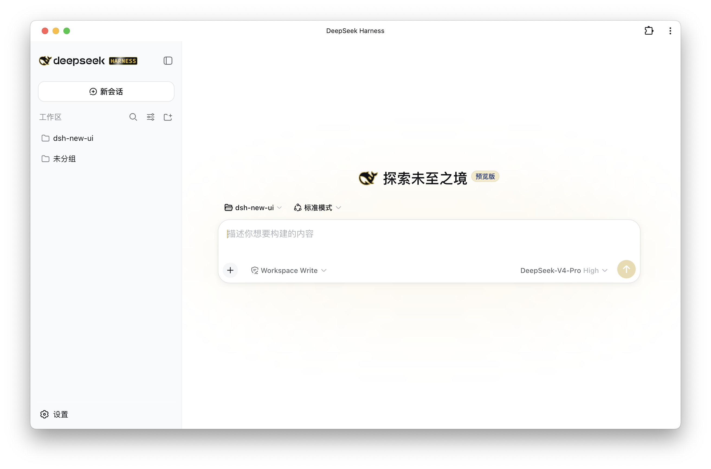
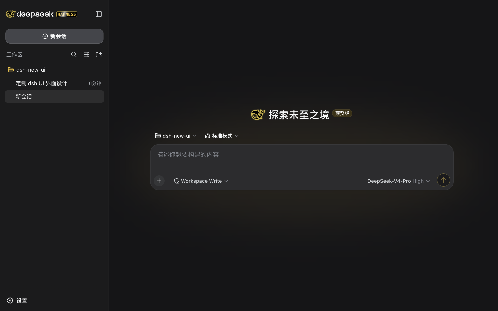

# @frostgao/dsh-theme-blackgold

黑金主题插件 · A black-gold theme plugin for the DeepSeek Harness.

[English](#english) · [中文](#chinese)

---

## Screenshots · 截图

| Light · 浅色 | Dark · 深色 |
| --- | --- |
|  |  |

---

<a id="english"></a>

## English

A **black-gold** theme plugin for [DeepSeek Harness](https://github.com/deepseek-ai/deepseek-harness): gold accents on a black-and-white base, in both light and dark mode.

### What it themes

**Brand mark (sidebar logo)**
- Whale logo: thin champagne-gold outline (no glow); smooth grow-and-tilt on hover; dark body + gold outline in dark mode.
- `HARNESS` badge: bright gold text on a black plate with a gold rim; periodic white shine sweep.
- `deepseek-official` letterforms stay ink-black.

**Full page (light + dark)**
- Brand / business accent → gold (send button, active chat/trajectory tab, active workspace folder, caret, highlights).
- Deep-diving "…" status → gold shimmer.
- Sidebar running-dot (StateDot) → gold pixel chase.
- Your own message bubble → sidebar gray (not gold).
- New-session hero radial glow → light gold.
- Trajectory view active states + ContextMeter "Messages" category → gold.

### Install

```bash
npm install @frostgao/dsh-theme-blackgold
```

Then add one row to your DSH profile's patch file (`~/.dsh/profiles/web/cordis.patch.yml`):

```yaml
- insert:
    - id: ui-blackgold-theme
      name: '@frostgao/dsh-theme-blackgold'
```

Restart `dsh web`.

### Requirements

- DeepSeek Harness (any recent version).
- The `@deepseek-ai/dsh-client-ui-theme` plugin must be composed (it is, in every shipped profile).

### Customizing the gold

All colors live in `lib/client.js`. Search for the hex values and change them:

| Role | Light | Dark |
|---|---|---|
| Page accent gold | `#C9A227` | `#F4C430` |
| Whale outline gold | `#C9A227` | `#C9A227` |
| Brand / border gold | `#CFB53B` | `#CFB53B` |
| HARNESS text gold | `#F4C430` | `#F4C430` |
| Hero glow / hover gold | `#E3C04B` / `#D9B44A` | `#E3C04B` |
| Dark background tint | — | `#3a3113` |

### Notes / caveats

- **Couples to the shipped `BrandWordmark` SVG**: the whale / HARNESS selectors target the official
  `viewBox="0 0 182 24"` wordmark and its internal `clip-path` ids. If the Harness redesigns that SVG,
  those selectors may need updating.
- This is a *presentation override*, not a semantic restyle: it rides CSS variables and a few
  component-level vars, so it degrades gracefully if the underlying UI changes.
- `prefers-reduced-motion` is respected: the hover motion and shine sweep are disabled for users who
  ask for reduced motion.

### Related

- [`@frostgao/dsh-usage-cost`](https://github.com/frostgao/dsh-usage-cost) — usage & cost tracking that pairs with this theme.

### License

MIT — see [LICENSE](./LICENSE).

---

<a id="chinese"></a>

## 中文

一个适用于 [DeepSeek Harness](https://github.com/deepseek-ai/deepseek-harness) 的 **黑金** 主题插件：黑白底上点缀金色强调，浅色 / 深色模式都支持。

### 主题内容

**品牌标记（侧栏 logo）**
- 鲸鱼 logo：细香槟金描边（无光晕）；悬停时平滑放大倾斜；深色模式下深色鲸身 + 金色描边。
- `HARNESS` 徽章：黑底金边、亮金文字；周期性白色扫光。
- `deepseek-official` 字母保持墨黑。

**全页（浅色 + 深色）**
- 品牌 / 业务强调色 → 金色（发送按钮、激活的聊天/轨迹页签、激活的工作区文件夹、光标、高亮）。
- 深度执行「…」状态 → 金色流光。
- 侧栏运行点（StateDot）→ 金色追逐。
- 自己的消息气泡 → 侧栏灰（不是金色）。
- 新建会话 hero 径向光晕 → 浅金。
- 轨迹视图激活态 + ContextMeter「Messages」分类 → 金色。

### 安装

```bash
npm install @frostgao/dsh-theme-blackgold
```

然后在 DSH profile 的补丁文件（`~/.dsh/profiles/web/cordis.patch.yml`）加一行：

```yaml
- insert:
    - id: ui-blackgold-theme
      name: '@frostgao/dsh-theme-blackgold'
```

重启 `dsh web`。

### 依赖要求

- DeepSeek Harness（任意近期版本）。
- 必须组合 `@deepseek-ai/dsh-client-ui-theme`（每个默认 profile 都已组合）。

### 自定义金色

所有颜色都在 `lib/client.js` 里，搜索 hex 值即可修改：

| 角色 | 浅色 | 深色 |
|---|---|---|
| 页面强调金 | `#C9A227` | `#F4C430` |
| 鲸鱼描边金 | `#C9A227` | `#C9A227` |
| 品牌 / 边框金 | `#CFB53B` | `#CFB53B` |
| HARNESS 文字金 | `#F4C430` | `#F4C430` |
| Hero 光晕 / 悬停金 | `#E3C04B` / `#D9B44A` | `#E3C04B` |
| 深色背景底 | — | `#3a3113` |

### 注意事项

- **耦合到官方 `BrandWordmark` SVG**：鲸鱼 / HARNESS 选择器针对官方
  `viewBox="0 0 182 24"` wordmark 及其内部 `clip-path` id。若 Harness 重绘该 SVG，这些选择器可能需要更新。
- 这是「呈现层覆盖」而非语义重构：它依托 CSS 变量和少量组件级变量，底层 UI 变化时能优雅降级。
- 尊重 `prefers-reduced-motion`：对请求减少动效的用户会禁用悬停动效和扫光。

### 相关项目

- [`@frostgao/dsh-usage-cost`](https://github.com/frostgao/dsh-usage-cost) —— 与本主题搭配的用量/成本统计插件。

### License

MIT — 见 [LICENSE](./LICENSE)。
